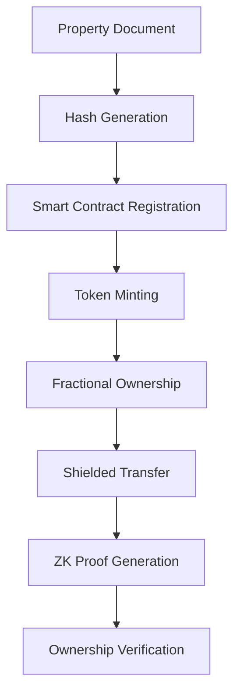

# 🏠 BrickChain - Property Trading as Simple as Sending Crypto

*Built during the MLH Midnight Hackathon - Transforming real estate with privacy-first blockchain technology*

---

## 🛠️ Tech Stack


---

## 🔍 Vision

Real estate trading is slow, paperwork-heavy, and full of intermediaries. **BrickChain** makes property trading as simple as sending cryptocurrency:

- **Tokenize** properties into fractional digital assets
- **Enable** private, seamless ownership transfers
- **Ensure** secure, verifiable proofs using zero-knowledge cryptography

With Midnight's privacy features, we create a compliant yet private foundation for global property markets.

---

## 🌟 Midnight Integration

### Core Features Powered by Midnight:

**🔐 Zero-Knowledge Proofs**
Property owners prove ownership without revealing sensitive documents

**🛡️ Shielded Transactions**
Property fractions traded privately - balances remain confidential

**📋 Selective Disclosure**
Show regulators only relevant proofs without exposing entire portfolio

---

## 📊 System Flow



### Process Steps:

1. **Property Registration** → Document hash stored on-chain
2. **Tokenization** → Smart contract mints fractional tokens
3. **Trading** → Shielded transactions for private transfers
4. **Verification** → ZK proofs for ownership confirmation

---

## 🏗️ Architecture

- **Contracts**: Compact smart contracts for tokenization and property management
- **CLI**: Command-line interface for deployment and testing
- **App**: Frontend application for user interactions
- **Docker**: Containerized services for easy deployment

---

## 📚 Documentation

We have comprehensive documentation to help you get started and build on BrickChain.

| Document | Description |
|---|---|
| **[Quick Start Guide](./docs/quick-start.md)** | A guide for hackathon participants to get a simple version of the DApp running as quickly as possible. |
| **[Development Setup Guide](./docs/development-setup.md)** | A more detailed guide on how to set up your development environment for building on BrickChain. |
| **[CLI Usage Guide](./docs/cli-usage.md)** | A comprehensive guide to the BrickChain CLI, with details on every command. |
| **[Smart Contracts](./docs/smart-contracts.md)** | A deep dive into the smart contract architecture, features, and functions. |
| **[Architecture](./docs/architecture.md)** | An overview of the system's architecture, components, and data flow. |
| **[Deployment Guide](./docs/deployment.md)** | A guide for deploying BrickChain to local, testnet, and production environments. |

---

## 🚀 Execution & Results

### Contract Compilation & Testing

The smart contracts compile successfully, and all 15 tests pass, ensuring the on-chain logic is robust and reliable.

```
> @midnight-ntwrk/counter-contract@0.1.0 test:compile
> npm run compact && vitest run

> @midnight-ntwrk/counter-contract@0.1.0 compact
> compact compile src/main.compact managed/main

RUN  v3.2.4 /home/atharnex/github-uwu/brickchain/contracts

 ✓ tests/main.test.ts (15 tests) 275ms

 Test Files  1 passed (1)
      Tests  15 passed (15)
   Start at  08:59:56
   Duration  845ms (transform 208ms, setup 0ms, collect 299ms, tests 275ms, environment 0ms, prepare 76ms)

Compiling 10 circuits:
```

### Test Case Summary

Our comprehensive test suite covers the following scenarios:

*   **Token Operations:**
    *   Mints tokens correctly
    *   Transfers tokens correctly
    *   Burns tokens correctly
    *   Pauses and unpauses the token
    *   Fails to mint when paused
    *   Fails to transfer with insufficient balance

*   **Property Operations:**
    *   Registers a property correctly
    *   Tokenizes a registered property
    *   Transfers ownership
    *   Deactivates a property

*   **Validation Checks:**
    *   Fails to mint a zero amount
    *   Fails to burn a zero amount
    *   Fails to tokenize an unregistered property
    *   Fails to re-register a property
    *   Initializes correctly

---

## 👨‍💻 Team Members

| Role        | Name         | GitHub Profile |
|-------------|--------------|----------------|
| **Lead**     | Md Athar Jamal Makki  | [@atharhive](https://github.com/atharhive)       |
| **Frontend** | Akshad Jogi  | [@akshad-exe](https://github.com/akshad-exe)     |
|  **Smart Contract Dev** | Ayush Sarkar  | [@dev-Ninjaa](https://github.com/dev-Ninjaa)      |
| **Backend**| Samarth Mahapatra | [@samarth3301](https://github.com/samarth3301) |

---

## 📄 License

Apache-2.0 License

---

<div align="center">
  <b>Built with ❤️ by Team Recursion</b>
  <br>
  <i>MLH Midnight Hackathon 2025</i>
</div>