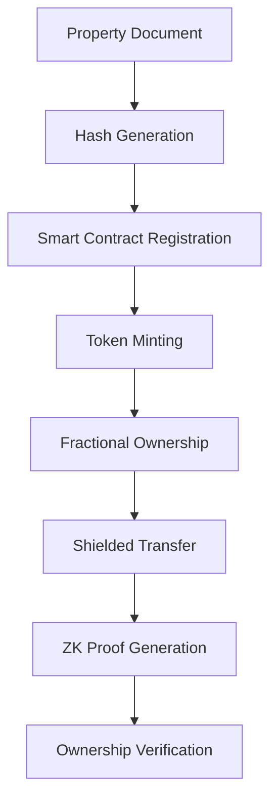

# 🏠 BrickChain -  makes property trading as simple as sending crypto

*Built during the MLH Midnight Hackathon - Transforming real estate with privacy-first blockchain technology*

---

## 🛠️ Tech Stack


---

## 🔍 Vision

Real estate trading is slow, paperwork-heavy, and full of intermediaries. **BrickChain** makes property trading as simple as sending cryptocurrency:

- **Tokenize** properties into fractional digital assets
- **Enable** private, seamless ownership transfers
- **Ensure** secure, verifiable proofs using zero-knowledge cryptography

With Midnight's privacy features, we create a compliant yet private foundation for global property markets.

---

## 🌟 Midnight Integration

### Core Features Powered by Midnight:

**🔐 Zero-Knowledge Proofs**  
Property owners prove ownership without revealing sensitive documents

**🛡️ Shielded Transactions**  
Property fractions traded privately - balances remain confidential

**📋 Selective Disclosure**  
Show regulators only relevant proofs without exposing entire portfolio

---

## 📊 System Flow



### Process Steps:

1. **Property Registration** → Document hash stored on-chain
2. **Tokenization** → Smart contract mints fractional tokens
3. **Trading** → Shielded transactions for private transfers  
4. **Verification** → ZK proofs for ownership confirmation

---

## 🏗️ Architecture

- **Contracts**: Compact smart contracts for tokenization and property management
- **CLI**: Command-line interface for deployment and testing
- **App**: Frontend application for user interactions
- **Docker**: Containerized services for easy deployment

---

## 🚀 Quick Start

```bash
# Clone the repository
git clone git@github.com:Recursion-Labs/brickchain.git
cd brickchain

# Install dependencies
npm install

# Build contracts
cd contracts && npm run build

# Run tests
npm test

# Start development environment
npm run standalone
```

---
## 👨‍💻 **Team Members**

| Role        | Name         | GitHub Profile |
|-------------|--------------|----------------|
| **Lead**     | Md Athar Jamal Makki  | [@atharhive](https://github.com/atharhive)       |
| **Frontend** | Akshad Jogi  | [@akshad-exe](https://github.com/akshad-exe)     |
| **Backend**  | Ayush Sarkar  | [@dev-Ninjaa](https://github.com/dev-Ninjaa)      |
| **Smart Contract Dev**| Samarth Mahapatra | [@samarth3301](https://github.com/samarth3301) | 

---

## 📄 License

Apache-2.0 License

---

<div align="center">
  <b>Built with ❤️ by Team Recursion</b>
  <br>
  <i>MLH Midnight Hackathon 2025</i>
</div>
