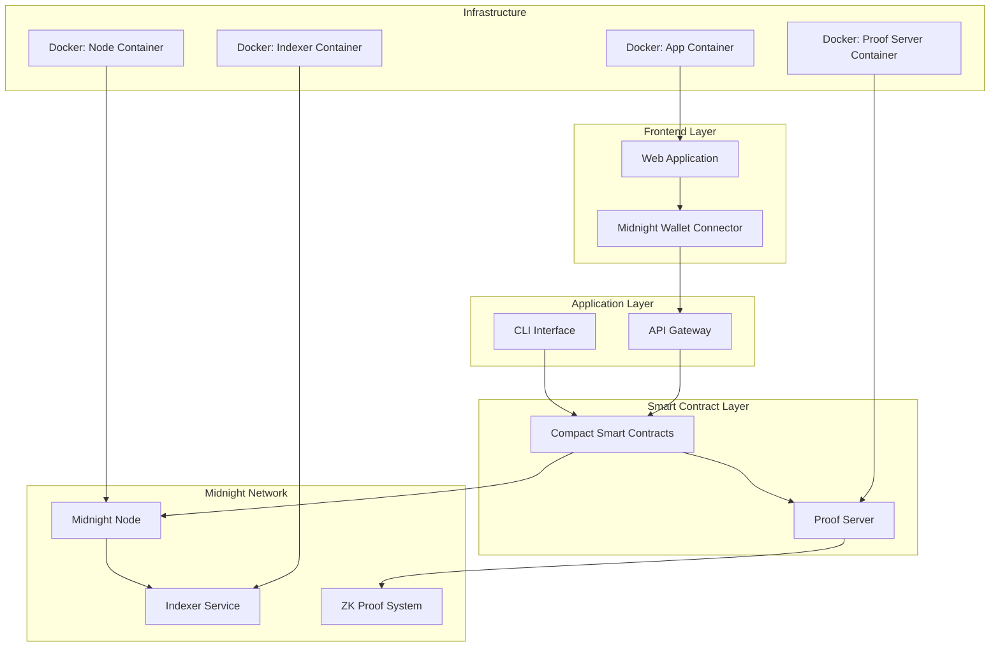
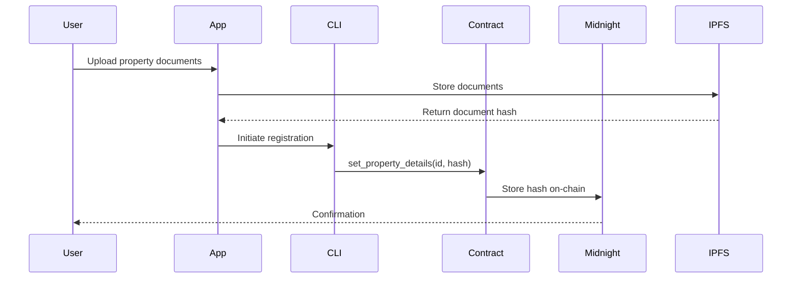
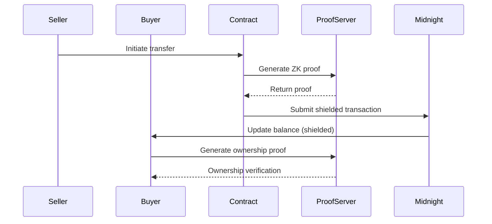
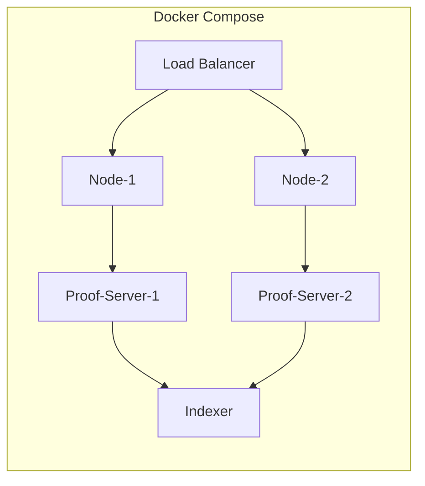

# BrickChain Architecture Documentation

## Table of Contents
1. [System Overview](#system-overview)
2. [Architecture Diagram](#architecture-diagram)
3. [Core Components](#core-components)
4. [Data Flow](#data-flow)
5. [Integration with Midnight Network](#integration-with-midnight-network)
6. [Security Architecture](#security-architecture)
7. [Deployment Architecture](#deployment-architecture)

## System Overview

BrickChain is a privacy-focused real estate tokenization platform built on the Midnight Network. The architecture leverages zero-knowledge proofs, shielded transactions, and selective disclosure to enable secure, private property trading while maintaining regulatory compliance.

### Key Architectural Principles
- **Privacy by Design**: All sensitive data is protected using ZK-proofs
- **Modular Architecture**: Components are loosely coupled for flexibility
- **Container-First Deployment**: All services run in Docker containers
- **Event-Driven Communication**: Components interact through events and state changes

## Architecture Diagram



## Core Components

### 1. Smart Contracts (`/contracts`)
**Technology**: Compact Language  
**Purpose**: Handles tokenization logic and property management

**Key Contracts**:
- `main.compact`: Core token contract implementing fungible tokens for real estate
  - Minting and burning capabilities
  - Transfer mechanisms with privacy
  - Property metadata management
  - Pausable token operations

**Features**:
- Zero-knowledge proof generation for ownership
- Shielded balance management
- Property document hash storage
- State management (Active, Paused, Frozen)

### 2. Command-Line Interface (`/cli`)
**Technology**: TypeScript/Node.js  
**Purpose**: Development and deployment interface

**Components**:
- Contract deployment scripts
- Testing utilities
- Network interaction tools
- Proof generation helpers

**Module Configuration**:
- `standalone.yml`: Local development configuration
- `proof-server.yml`: Proof server settings
- `proof-testnet.yml`: Testnet configuration

### 3. Frontend Application (`/app`)
**Technology**: TypeScript, MidnightJS  
**Purpose**: User interface for property trading

**Features**:
- Wallet integration via DApp Connector
- Property listing and browsing
- Token trading interface
- Transaction history
- Portfolio management

### 4. Docker Infrastructure (`/docker`)
**Purpose**: Containerized deployment and orchestration

**Containers**:

#### a. Node Container (`/docker/node`)
- Runs Midnight node instance
- Handles blockchain consensus
- Processes transactions

#### b. Proof Server Container (`/docker/proof-server`)
- Generates zero-knowledge proofs
- Validates proof submissions
- Manages proof caching

#### c. Indexer Container (`/docker/indexer`)
- Indexes blockchain data
- Provides query API
- Maintains state database

#### d. Production Container (`/docker/prod`)
- Orchestrates all services
- Manages networking
- Handles load balancing

## Data Flow

### 1. Property Registration Flow


### 2. Token Trading Flow


## Integration with Midnight Network

### 1. Compact Language Integration
- Smart contracts written in Compact for privacy-preserving computation
- Automatic proof generation for state transitions
- Built-in support for shielded and transparent operations

### 2. MidnightJS SDK
- Frontend integration for wallet connections
- Transaction building and signing
- State querying and monitoring

### 3. DApp Connector
- Seamless wallet integration (Lace, etc.)
- Transaction approval flows
- Account management

### 4. Proof Server
- Standalone or Docker-based deployment
- Handles computationally intensive proof generation
- Caches proofs for performance

### 5. Network Interaction
```typescript
// Example: Connecting to Midnight Network
import { MidnightProvider } from '@midnight-ntwrk/midnight-js';

const provider = new MidnightProvider({
  network: 'testnet',
  proofServer: 'http://localhost:6300',
  indexer: 'http://localhost:8080'
});
```

## Security Architecture

### 1. Privacy Layers
- **Level 1**: Public data (property IDs, token symbols)
- **Level 2**: Shielded data (balances, ownership)
- **Level 3**: Private data (off-chain documents)

### 2. Zero-Knowledge Proofs
- Ownership verification without revealing holdings
- Balance proofs for trading eligibility
- Compliance proofs for regulatory requirements

### 3. Access Control
```
Contract Owner -> Full admin rights
Token Holders -> Transfer, view balance
Public -> View public metadata only
Regulators -> Selective disclosure proofs
```

### 4. Data Storage Strategy
- **On-chain**: Hashes, public metadata, token state
- **Off-chain**: Property documents, images, detailed descriptions
- **IPFS**: Decentralized document storage
- **Local Cache**: Proof caching for performance

## Deployment Architecture

### 1. Development Environment
```yaml
Services:
  - Midnight Node (Local)
  - Proof Server (Standalone)
  - Indexer (Local)
  - Frontend (Dev Server)
```

### 2. Testnet Deployment
```yaml
Services:
  - Midnight Testnet Connection
  - Remote Proof Server
  - Testnet Indexer
  - Hosted Frontend
```

### 3. Production Architecture
```yaml
Services:
  - Multiple Midnight Nodes (HA)
  - Load-Balanced Proof Servers
  - Replicated Indexers
  - CDN-Hosted Frontend
  - Monitoring & Logging
```

### 4. Container Orchestration


## Performance Considerations

### 1. Proof Generation
- Cached proofs for common operations
- Parallel proof generation for batch operations
- Optimized proof circuits for gas efficiency

### 2. State Management
- Efficient ledger queries through indexer
- Batched transactions for reduced fees
- State compression for storage optimization

### 3. Scalability
- Horizontal scaling of proof servers
- Database sharding for indexer
- CDN distribution for frontend assets

## Technology Stack Details

### Core Technologies
- **Blockchain**: Midnight Network (Layer 1)
- **Smart Contracts**: Compact Language
- **Runtime**: Node.js (v18+)
- **Package Manager**: npm/yarn/bun
- **Containerization**: Docker & Docker Compose
- **Testing**: Vitest
- **Language**: TypeScript

### Development Tools
- **Compact Compiler**: For contract compilation
- **Midnight CLI**: Network interaction
- **Proof Server**: Local or remote ZK proof generation
- **Indexer**: Blockchain data querying

## API Layers

### 1. Contract API (Compact)
```compact
circuit mint(to: Uint<32>, amount: Uint<64>)
circuit transfer(from: Uint<32>, to: Uint<32>, amount: Uint<64>)
circuit burn(from: Uint<32>, amount: Uint<64>)
circuit set_property_details(property_id: Uint<32>, details_hash: Bytes<64>)
```

### 2. CLI API
```bash
# Contract deployment
npm run deploy-testnet

# Token operations
npm run mint -- --to <address> --amount <tokens>
npm run transfer -- --from <address> --to <address> --amount <tokens>
```

### 3. Frontend API (MidnightJS)
```typescript
// Wallet connection
await provider.connect();

// Contract interaction
const contract = new Contract(address, abi, provider);
await contract.mint(recipient, amount);
```

## Future Architecture Enhancements

### Planned Features
1. **Multi-chain Bridge**: Cross-chain property token transfers
2. **Oracle Integration**: Real-world property data feeds
3. **DAO Governance**: Decentralized property management
4. **Advanced Privacy**: Ring signatures and stealth addresses
5. **Layer 2 Scaling**: State channels for high-frequency trading

### Optimization Opportunities
1. **Proof Aggregation**: Batch multiple proofs into one
2. **State Channels**: Off-chain trading with on-chain settlement
3. **IPFS Pinning**: Distributed property document storage
4. **GraphQL API**: Efficient data querying layer

## Monitoring and Observability

### Metrics Collection
- Transaction throughput
- Proof generation time
- Gas consumption
- User activity patterns

### Logging Strategy
```yaml
Components:
  - Application Logs: winston/bunyan
  - Container Logs: Docker logging driver
  - Network Logs: Midnight node logs
  - Audit Logs: Compliance tracking
```

### Health Checks
- Node synchronization status
- Proof server availability
- Indexer query performance
- Frontend uptime monitoring

## Conclusion

BrickChain's architecture leverages Midnight Network's privacy features to create a secure, scalable platform for real estate tokenization. The modular design allows for flexible deployment scenarios while maintaining strong privacy guarantees through zero-knowledge proofs and shielded transactions.
