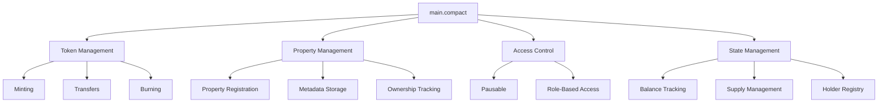

# BrickChain Smart Contracts Documentation

## Table of Contents
1. [Overview](#overview)
2. [Compact Language Introduction](#compact-language-introduction)
3. [Main Contract Architecture](#main-contract-architecture)
4. [Contract Features](#contract-features)
5. [Ledger Structure](#ledger-structure)
6. [Circuit Functions](#circuit-functions)
7. [Privacy Mechanisms](#privacy-mechanisms)
8. [Contract Deployment](#contract-deployment)
9. [Testing Smart Contracts](#testing-smart-contracts)
10. [Security Considerations](#security-considerations)
11. [Gas Optimization](#gas-optimization)
12. [Future Enhancements](#future-enhancements)

## Overview

BrickChain's smart contracts are written in **Compact**, Midnight Network's domain-specific language designed for privacy-preserving smart contracts. The contracts enable tokenization of real estate properties with built-in privacy features, including shielded balances, zero-knowledge proofs, and selective disclosure.

### Key Contract Files
- `contracts/main.compact` - Core token contract for real estate tokenization
- `contracts/lib/` - Supporting libraries and utilities
- `contracts/test/` - Contract test suites

## Compact Language Introduction

Compact is Midnight's smart contract language that provides:

### Language Features
1. **Privacy by Default**: All data is private unless explicitly made public
2. **Zero-Knowledge Proofs**: Automatic proof generation for state transitions
3. **Type Safety**: Strong typing system preventing common vulnerabilities
4. **Circuit-Based**: Functions are circuits that generate proofs

### Basic Syntax
```compact
// Import statements
use std::*;

// Type definitions
type PropertyId = Uint<32>;
type TokenAmount = Uint<64>;
type PropertyHash = Bytes<64>;

// Enum for token states
enum TokenState {
    Active,
    Paused,
    Frozen
}

// Contract definition
contract RealEstateToken {
    // Ledger declarations
    ledger total_supply: Uint<64>;
    ledger balances: Map<Address, TokenAmount>;
    
    // Circuit (function) definitions
    circuit mint(to: Address, amount: TokenAmount) {
        // Implementation
    }
}
```

## Main Contract Architecture

### Contract: `main.compact`

The main contract implements a fungible token system specifically designed for real estate tokenization with the following architecture:



### Core Components

#### 1. Token State Management
```compact
enum TokenState {
    Active,    // Normal operations allowed
    Paused,    // Temporary halt of operations
    Frozen     // Permanent freeze (future use)
}

ledger token_state: TokenState = TokenState::Active;
```

#### 2. Supply Tracking
```compact
ledger total_supply: Uint<64> = 0;      // Total tokens minted
ledger circulating_supply: Uint<64> = 0; // Tokens in circulation
ledger nonce: Counter = 0;               // State change counter
```

#### 3. Balance Management
```compact
ledger balances: Map<Uint<32>, Uint<64>>;  // Address -> Balance mapping
ledger holders: Map<Uint<32>, Boolean>;    // Track active holders
ledger holder_count: Uint<64> = 0;         // Number of unique holders
```

## Contract Features

### 1. Real Estate Tokenization
- **Property Registration**: Store property metadata hash on-chain
- **Fractional Ownership**: Divide properties into tradeable tokens
- **Document Verification**: Link off-chain documents via hash

### 2. Privacy Features
- **Shielded Balances**: Token balances remain private
- **Zero-Knowledge Transfers**: Prove transfer validity without revealing amounts
- **Selective Disclosure**: Choose what information to reveal

### 3. Advanced Token Features
- **Pausable Operations**: Emergency pause mechanism
- **Burn Mechanism**: Reduce token supply
- **Holder Tracking**: Monitor unique token holders

## Ledger Structure

### Complete Ledger Specification

| Ledger Name | Type | Initial Value | Description | Privacy Level |
|------------|------|---------------|-------------|---------------|
| `total_supply` | `Uint<64>` | 0 | Total tokens ever minted | Public |
| `circulating_supply` | `Uint<64>` | 0 | Current tokens in circulation | Public |
| `nonce` | `Counter` | 0 | Incremental state counter | Public |
| `token_state` | `TokenState` | Active | Current operational state | Public |
| `holder_count` | `Uint<64>` | 0 | Number of unique holders | Public |
| `balances` | `Map<Uint<32>, Uint<64>>` | Empty | Address to balance mapping | Shielded |
| `holders` | `Map<Uint<32>, Boolean>` | Empty | Active holder tracking | Shielded |
| `property_details` | `Map<Uint<32>, Bytes<64>>` | Empty | Property ID to metadata hash | Public |

### Storage Patterns
```compact
// Public storage - visible to all
ledger public_data: Uint<64>;

// Shielded storage - private by default
ledger shielded private_balances: Map<Address, Uint<64>>;

// Witness storage - temporary computation data
witness computation_data: Bytes<32>;
```

## Circuit Functions

### 1. Minting Function
```compact
circuit mint(to: Uint<32>, amount: Uint<64>) {
    // Preconditions
    assert(token_state == TokenState::Active, "Token is not active");
    assert(amount > 0, "Amount must be positive");
    
    // Get current balance
    let current_balance = balances.lookup_default(to, 0);
    let new_balance = current_balance + amount;
    
    // Update ledgers
    balances.insert(to, new_balance);
    total_supply = total_supply + amount;
    circulating_supply = circulating_supply + amount;
    
    // Update holder tracking
    if (!holders.lookup_default(to, false)) {
        holders.insert(to, true);
        holder_count = holder_count + 1;
    }
    
    // Increment nonce
    nonce.increment();
}
```

### 2. Transfer Function
```compact
circuit transfer(from: Uint<32>, to: Uint<32>, amount: Uint<64>) {
    // Preconditions
    assert(token_state == TokenState::Active, "Token is not active");
    assert(amount > 0, "Amount must be positive");
    assert(from != to, "Cannot transfer to self");
    
    // Check balance
    let sender_balance = balances.lookup_default(from, 0);
    assert(sender_balance >= amount, "Insufficient balance");
    
    // Update balances
    let new_sender_balance = sender_balance - amount;
    let recipient_balance = balances.lookup_default(to, 0);
    let new_recipient_balance = recipient_balance + amount;
    
    balances.insert(from, new_sender_balance);
    balances.insert(to, new_recipient_balance);
    
    // Update holder status
    if (new_sender_balance == 0) {
        holders.insert(from, false);
        holder_count = holder_count - 1;
    }
    
    if (recipient_balance == 0) {
        holders.insert(to, true);
        holder_count = holder_count + 1;
    }
    
    nonce.increment();
}
```

### 3. Burn Function
```compact
circuit burn(from: Uint<32>, amount: Uint<64>) {
    // Preconditions
    assert(token_state == TokenState::Active, "Token is not active");
    assert(amount > 0, "Amount must be positive");
    
    // Check balance
    let balance = balances.lookup_default(from, 0);
    assert(balance >= amount, "Insufficient balance");
    
    // Update balance and supply
    let new_balance = balance - amount;
    balances.insert(from, new_balance);
    circulating_supply = circulating_supply - amount;
    
    // Update holder status if balance is zero
    if (new_balance == 0) {
        holders.insert(from, false);
        holder_count = holder_count - 1;
    }
    
    nonce.increment();
}
```

### 4. Property Management Functions
```compact
circuit set_property_details(property_id: Uint<32>, details_hash: Bytes<64>) {
    // Store property metadata hash
    property_details.insert(property_id, details_hash);
    nonce.increment();
}

circuit get_property_details(property_id: Uint<32>) -> Bytes<64> {
    // Retrieve property metadata hash
    return property_details.lookup_default(property_id, empty_bytes());
}
```

### 5. State Management Functions
```compact
circuit pause_token() {
    assert(token_state == TokenState::Active, "Token is already paused");
    token_state = TokenState::Paused;
    nonce.increment();
}

circuit unpause_token() {
    assert(token_state == TokenState::Paused, "Token is not paused");
    token_state = TokenState::Active;
    nonce.increment();
}
```

## Privacy Mechanisms

### 1. Shielded Operations
```compact
// Shielded transfer - amounts remain private
circuit shielded_transfer(
    from: Address,
    to: Address,
    amount: witness Uint<64>,  // witness makes it private
    proof: ZKProof
) {
    // Verify proof of balance
    assert(verify_balance_proof(from, amount, proof));
    
    // Perform transfer with hidden amounts
    perform_shielded_transfer(from, to, amount);
}
```

### 2. Zero-Knowledge Proofs
```compact
// Prove ownership without revealing balance
circuit prove_ownership(
    owner: Address,
    min_balance: Uint<64>
) -> ZKProof {
    let balance = balances.lookup_default(owner, 0);
    assert(balance >= min_balance);
    
    // Generate proof without revealing actual balance
    return generate_ownership_proof(owner, balance, min_balance);
}
```

### 3. Selective Disclosure
```compact
// Reveal specific information for compliance
circuit selective_disclosure(
    owner: Address,
    disclosure_type: DisclosureType
) -> DisclosureProof {
    match disclosure_type {
        DisclosureType::Balance => reveal_balance(owner),
        DisclosureType::Transactions => reveal_transactions(owner),
        DisclosureType::Holdings => reveal_holdings(owner),
        _ => generate_null_proof()
    }
}
```

## Contract Deployment

### 1. Local Deployment
```bash
# Compile the contract
cd contracts
npx compact compile main.compact

# Deploy to local network
npx compact deploy \
  --contract main.compact \
  --network local \
  --private-key $PRIVATE_KEY

# Output: Contract address and transaction hash
```

### 2. Testnet Deployment
```typescript
// deployment/deploy-testnet.ts
import { CompactContract, MidnightProvider } from '@midnight-ntwrk/compact-sdk';

async function deployToTestnet() {
    // Connect to testnet
    const provider = new MidnightProvider({
        network: 'testnet',
        proofServer: 'https://proof.midnight-testnet.network'
    });
    
    // Load compiled contract
    const contractBytecode = fs.readFileSync('./build/main.wasm');
    const contractABI = JSON.parse(fs.readFileSync('./build/main.json'));
    
    // Deploy contract
    const contract = await CompactContract.deploy(
        provider,
        contractBytecode,
        contractABI,
        {
            gasLimit: 5000000,
            initialSupply: 1000000n
        }
    );
    
    console.log('Contract deployed at:', contract.address);
    return contract;
}
```

### 3. Mainnet Deployment
```typescript
// deployment/deploy-mainnet.ts
async function deployToMainnet() {
    // Additional security checks for mainnet
    const auditReport = await loadAuditReport();
    assert(auditReport.passed, "Audit must pass before mainnet deployment");
    
    // Multi-sig deployment
    const multiSigWallet = await getMultiSigWallet();
    const deploymentTx = await createDeploymentTransaction();
    
    // Collect signatures
    const signatures = await collectSignatures(deploymentTx);
    
    // Deploy with multi-sig
    const contract = await multiSigWallet.deployContract(
        deploymentTx,
        signatures
    );
    
    return contract;
}
```

## Testing Smart Contracts

### 1. Unit Tests
```typescript
// test/token.test.ts
import { expect } from 'chai';
import { CompactContract, TestProvider } from '@midnight-ntwrk/compact-sdk';

describe('RealEstateToken', () => {
    let contract: CompactContract;
    let owner: Account;
    let user1: Account;
    
    beforeEach(async () => {
        const provider = new TestProvider();
        contract = await deployContract(provider);
        [owner, user1] = await provider.getAccounts();
    });
    
    describe('Minting', () => {
        it('should mint tokens to address', async () => {
            const amount = 1000n;
            await contract.mint(user1.address, amount);
            
            const balance = await contract.balanceOf(user1.address);
            expect(balance).to.equal(amount);
        });
        
        it('should fail when paused', async () => {
            await contract.pause();
            await expect(
                contract.mint(user1.address, 1000n)
            ).to.be.revertedWith('Token is not active');
        });
    });
    
    describe('Transfers', () => {
        it('should transfer tokens between addresses', async () => {
            await contract.mint(user1.address, 1000n);
            await contract.transfer(user1.address, user2.address, 500n);
            
            expect(await contract.balanceOf(user1.address)).to.equal(500n);
            expect(await contract.balanceOf(user2.address)).to.equal(500n);
        });
    });
});
```

### 2. Integration Tests
```typescript
// test/integration/property-tokenization.test.ts
describe('Property Tokenization Flow', () => {
    it('should complete full property tokenization', async () => {
        // 1. Register property
        const propertyId = 101;
        const propertyHash = sha256('property_document');
        await contract.setPropertyDetails(propertyId, propertyHash);
        
        // 2. Mint tokens for property
        const totalTokens = 1000000n; // 1M tokens for property
        await contract.mint(owner.address, totalTokens);
        
        // 3. Distribute to investors
        const investors = [investor1, investor2, investor3];
        for (const investor of investors) {
            await contract.transfer(
                owner.address,
                investor.address,
                totalTokens / 3n
            );
        }
        
        // 4. Verify ownership distribution
        for (const investor of investors) {
            const balance = await contract.balanceOf(investor.address);
            expect(balance).to.be.greaterThan(0n);
        }
    });
});
```

### 3. Privacy Tests
```typescript
// test/privacy/shielded-operations.test.ts
describe('Privacy Features', () => {
    it('should perform shielded transfer', async () => {
        // Mint tokens shielded
        await contract.mintShielded(user1.address, 1000n);
        
        // Transfer should not reveal amounts
        const tx = await contract.shieldedTransfer(
            user1.address,
            user2.address,
            500n
        );
        
        // Transaction should not contain visible amounts
        expect(tx.data).to.not.contain('500');
        
        // But balances should be updated (provable via ZK)
        const proof = await contract.proveBalance(user2.address, 500n);
        expect(await verifyProof(proof)).to.be.true;
    });
});
```

## Security Considerations

### 1. Access Control
```compact
// Role-based access control
enum Role {
    Owner,
    Admin,
    Minter,
    User
}

ledger roles: Map<Address, Role>;

modifier onlyOwner() {
    assert(roles.lookup(msg.sender) == Role::Owner, "Not owner");
    _;
}

modifier onlyMinter() {
    let role = roles.lookup(msg.sender);
    assert(role == Role::Owner || role == Role::Minter, "Not minter");
    _;
}

circuit mint(to: Address, amount: Uint<64>) onlyMinter {
    // Minting logic
}
```

### 2. Reentrancy Protection
```compact
ledger locked: Boolean = false;

modifier nonReentrant() {
    assert(!locked, "Reentrant call");
    locked = true;
    _;
    locked = false;
}

circuit transfer(from: Address, to: Address, amount: Uint<64>) nonReentrant {
    // Transfer logic
}
```

### 3. Integer Overflow Protection
```compact
circuit safe_add(a: Uint<64>, b: Uint<64>) -> Uint<64> {
    let result = a + b;
    assert(result >= a, "Integer overflow");
    return result;
}

circuit safe_sub(a: Uint<64>, b: Uint<64>) -> Uint<64> {
    assert(a >= b, "Integer underflow");
    return a - b;
}
```

### 4. Input Validation
```compact
circuit validate_address(addr: Address) {
    assert(addr != Address::zero(), "Invalid address");
    assert(addr != contract_address(), "Cannot be contract");
}

circuit validate_amount(amount: Uint<64>) {
    assert(amount > 0, "Amount must be positive");
    assert(amount <= MAX_SUPPLY, "Amount exceeds max supply");
}
```

## Gas Optimization

### 1. Storage Optimization
```compact
// Pack multiple values into single storage slot
struct PackedData {
    balance: Uint<128>,
    nonce: Uint<64>,
    flags: Uint<64>
}

ledger packed_storage: Map<Address, PackedData>;
```

### 2. Batch Operations
```compact
circuit batch_transfer(
    from: Address,
    recipients: Vec<Address>,
    amounts: Vec<Uint<64>>
) {
    assert(recipients.len() == amounts.len(), "Length mismatch");
    
    let total = amounts.sum();
    assert(balances.lookup(from) >= total, "Insufficient balance");
    
    for (i, recipient) in recipients.enumerate() {
        internal_transfer(from, recipient, amounts[i]);
    }
}
```

### 3. Caching Patterns
```compact
witness cached_balance: Uint<64>;

circuit optimized_transfer(from: Address, to: Address, amount: Uint<64>) {
    // Cache balance in witness for multiple uses
    cached_balance = balances.lookup(from);
    
    assert(cached_balance >= amount);
    
    // Use cached value
    balances.insert(from, cached_balance - amount);
    // ... rest of logic
}
```

## Future Enhancements

### 1. Advanced Features Roadmap
- **Dividend Distribution**: Automatic profit sharing for token holders
- **Governance Voting**: Token-weighted voting for property decisions
- **Cross-chain Bridge**: Transfer tokens to other blockchains
- **Oracle Integration**: Real-time property value updates

### 2. Planned Contract Upgrades
```compact
// Upgradeable contract pattern
contract RealEstateTokenV2 {
    ledger implementation: Address;
    ledger version: Uint<32>;
    
    circuit upgrade(new_implementation: Address) onlyOwner {
        implementation = new_implementation;
        version = version + 1;
    }
    
    // Delegate calls to implementation
    circuit delegateCall(data: Bytes) {
        let result = implementation.delegateCall(data);
        return result;
    }
}
```

### 3. Enhanced Privacy Features
```compact
// Ring signatures for anonymous transfers
circuit ring_transfer(
    ring_members: Vec<Address>,
    recipient: Address,
    amount: witness Uint<64>,
    ring_signature: RingSignature
) {
    assert(verify_ring_signature(ring_members, ring_signature));
    perform_anonymous_transfer(recipient, amount);
}

// Stealth addresses for recipient privacy
circuit stealth_transfer(
    stealth_address: StealthAddress,
    amount: Uint<64>,
    ephemeral_key: PublicKey
) {
    let real_address = derive_address(stealth_address, ephemeral_key);
    transfer(msg.sender, real_address, amount);
}
```

## Best Practices

### 1. Development Guidelines
- Always use SafeMath operations
- Implement comprehensive input validation
- Follow checks-effects-interactions pattern
- Use events for important state changes
- Document all public functions

### 2. Testing Requirements
- 100% code coverage for critical paths
- Fuzz testing for input validation
- Integration tests for complete flows
- Gas consumption benchmarks
- Security audit before mainnet

### 3. Deployment Checklist
- [ ] Contract audit completed
- [ ] Test coverage > 95%
- [ ] Gas optimization performed
- [ ] Documentation updated
- [ ] Multi-sig wallet configured
- [ ] Monitoring alerts set up
- [ ] Incident response plan ready

## Contract Interaction Examples

### Using Web3/EthersJS
```typescript
// Connect to contract
const contract = new ethers.Contract(
    CONTRACT_ADDRESS,
    CONTRACT_ABI,
    signer
);

// Mint tokens
const tx = await contract.mint(recipientAddress, ethers.parseUnits("1000", 18));
await tx.wait();

// Check balance
const balance = await contract.balanceOf(address);
console.log('Balance:', ethers.formatUnits(balance, 18));
```

### Using MidnightJS
```typescript
import { MidnightProvider, Contract } from '@midnight-ntwrk/midnight-js';

const provider = new MidnightProvider({ network: 'mainnet' });
const contract = new Contract(ADDRESS, ABI, provider);

// Shielded transfer
const proof = await generateTransferProof(amount);
await contract.shieldedTransfer(to, amount, proof);
```

## Conclusion

The BrickChain smart contracts provide a robust, secure, and privacy-preserving foundation for real estate tokenization. Built on Midnight Network's Compact language, they leverage zero-knowledge proofs and shielded operations to enable confidential property trading while maintaining regulatory compliance through selective disclosure mechanisms.
